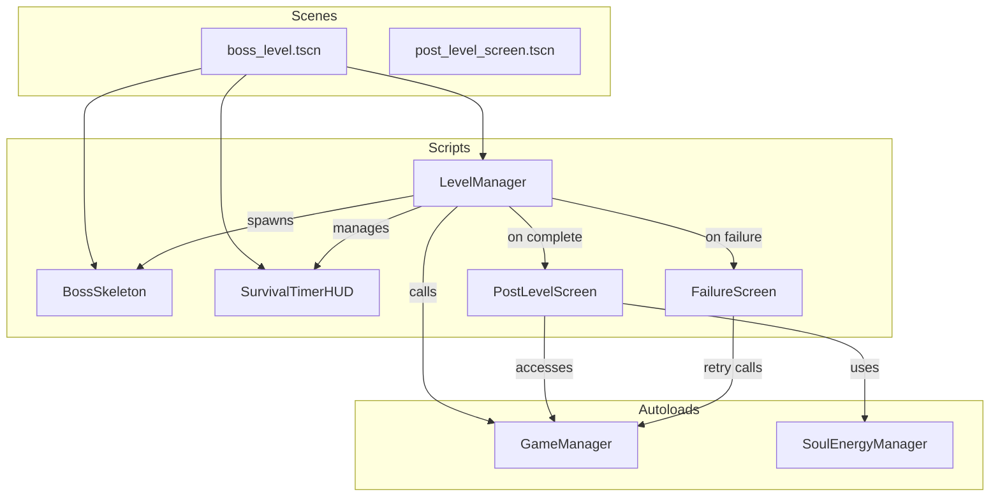
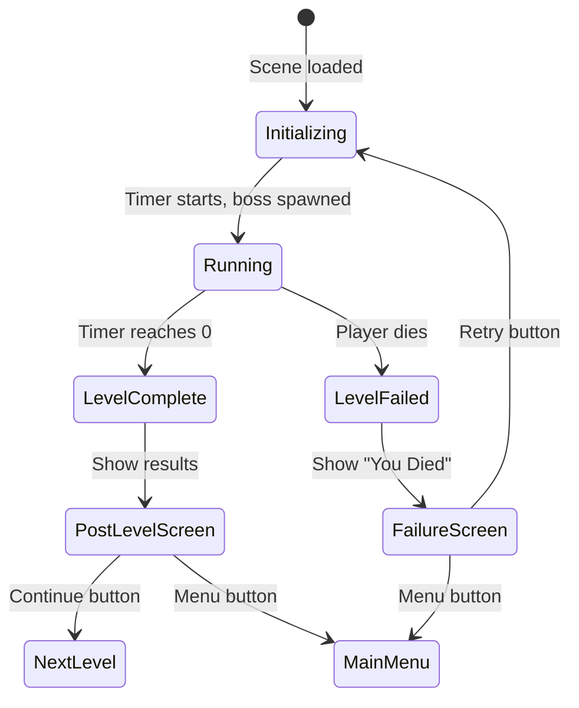

# Design Document: Boss Level System

## Overview

This design introduces a boss level system to Dark Ascension, adding structured level flow with win/loss conditions to what is currently an open-ended arena. The system consists of four main additions:

1. A `BossSkeleton` entity extending `SkeletonEnemy` with scaled-up stats
2. A `LevelManager` script that orchestrates the boss level lifecycle (timer, spawning, win/loss states, transitions)
3. A `SurvivalTimerHUD` UI element for the countdown display
4. A `PostLevelScreen` UI for level completion/failure with shard shop and relic grid access

The boss level replaces the current `arena_test.tscn` as the primary gameplay scene. The player must survive 20 seconds against the boss skeleton to win. On completion, the player accesses the shard shop and relic grid before proceeding. On failure, the player can retry or return to the main menu.

## Architecture

The system follows the existing project patterns: entities in `scripts/entities/`, systems in `scripts/systems/`, UI in `scripts/ui/`, and scenes in `scenes/`. The `GameManager` autoload already provides `save_run_state()`, `load_run_state()`, `start_new_run()`, and `award_relic()` — the LevelManager calls these at the appropriate lifecycle points.



### Level Lifecycle State Machine



## Components and Interfaces

### 1. BossSkeleton (`scripts/entities/boss_skeleton.gd`)

Extends `SkeletonEnemy`. Overrides stats in `_ready()` following the same pattern as `SkeletonEnemy` extends `Enemy`.

```gdscript
extends SkeletonEnemy
class_name BossSkeleton

signal boss_defeated

func _ready():
    super._ready()
    max_health = 200.0
    move_speed = 70.0
    contact_damage = 20.0
    soul_value = 50
    current_health = max_health
    scale = Vector2(2.0, 2.0)
    update_health_bar()

func die():
    boss_defeated.emit()
    super.die()
```

Key decisions:
- Emits `boss_defeated` signal before calling `super.die()` so the LevelManager can react
- Uses `scale = Vector2(2.0, 2.0)` on the node itself for visual scaling (consistent with Godot 2D scaling)
- Inherits all attack behavior from SkeletonEnemy (attack range, cooldown, melee attack pattern)

### 2. LevelManager (`scripts/systems/level_manager.gd`)

Central orchestrator for the boss level. Attached to the root node of `boss_level.tscn`.

```gdscript
extends Node2D
class_name LevelManager

signal level_completed
signal level_failed

@export var survival_time: float = 20.0
@export var boss_spawn_distance: float = 400.0
@export var enable_enemy_spawner: bool = false  # Configurable for future

var time_remaining: float = 0.0
var is_running: bool = false
var boss: BossSkeleton = null
var player: Player = null
```

Public interface:
- `start_level()` — Initializes timer, spawns boss, loads run state
- `_on_level_complete()` — Cleans up arena, shows PostLevelScreen, calls `award_relic()`
- `_on_level_failed()` — Cleans up arena, shows failure screen
- `get_time_remaining() -> float` — Used by HUD for display
- `is_timer_active() -> bool` — Guard for HUD updates

The LevelManager monitors the player's health by connecting to a `player_died` signal. Since the current `Player.die()` calls `reload_current_scene`, we need to modify it to emit a signal instead when inside a managed level. The LevelManager will set a flag on the player or connect before the player's death triggers a reload.

Design decision: Rather than modifying the Player class, the LevelManager will override the player's death behavior by connecting to the player's health changes and intercepting death. Specifically, the LevelManager will check `player.current_health <= 0` each frame during the running state, or we add a `player_died` signal to Player that fires before the scene reload. The cleaner approach is to add a `player_died` signal to `Player` and have `die()` emit it before the deferred reload. The LevelManager connects to this signal and, when handling a managed level, prevents the default reload by setting a flag.

Revised approach for player death detection:
- Add `signal player_died` to `Player`
- In `Player.die()`, emit `player_died` before the deferred reload
- Add `var managed_level: bool = false` to `Player` — when true, `die()` skips the scene reload
- LevelManager sets `player.managed_level = true` and connects to `player_died`

### 3. SurvivalTimerHUD (`scripts/ui/survival_timer_hud.gd`)

A `Label` node added to the player's `CanvasLayer`, following the same pattern as `SoulEnergyHUD`.

```gdscript
extends Label
class_name SurvivalTimerHUD
```

Formatting rules:
- Above 10s: display as whole seconds, rounded up (e.g., "15")
- At or below 10s: display with one decimal place (e.g., "8.3")
- At or below 5s: text color changes to red (`Color.RED`)
- Default color: white

The HUD reads `time_remaining` from the LevelManager each frame. The LevelManager passes a reference to itself, or the HUD finds it via group/tree.

Design decision: The LevelManager will add the SurvivalTimerHUD to the player's CanvasLayer programmatically (same pattern as `SoulEnergyHUD` in `Player._setup_soul_energy_hud()`). Alternatively, the LevelManager creates the HUD as its own child CanvasLayer. The latter is cleaner since the timer is level-scoped, not player-scoped.

Chosen approach: LevelManager creates a `CanvasLayer` with the `SurvivalTimerHUD` as a child. This keeps the timer lifecycle tied to the level, not the player.

### 4. PostLevelScreen (`scripts/ui/post_level_screen.gd`)

A `Control` node displayed as an overlay after level completion. Contains:
- Soul energy earned display
- ShardShopUI instance (existing class)
- RelicGridUI instance (existing class)
- "Next Level" button
- "Main Menu" button

```gdscript
extends Control
class_name PostLevelScreen

signal continue_pressed
signal menu_pressed
```

The PostLevelScreen calls `GameManager.shard_shop.generate_offers()` when shown to create fresh shop offers. It reuses the existing `ShardShopUI` and `RelicGridUI` classes directly.

### 5. FailureScreen (`scripts/ui/failure_screen.gd`)

A simple `Control` overlay with:
- "You Died" text
- Retry button → calls `GameManager.start_new_run()` then reloads the boss level scene
- Main Menu button → changes scene to main menu

```gdscript
extends Control
class_name FailureScreen

signal retry_pressed
signal menu_pressed
```

### 6. Boss Level Scene (`scenes/dungeon/boss_level.tscn`)

Scene tree structure:
```
BossLevel (Node2D) [LevelManager script]
├── ColorRect (background)
├── Player (instance of player.tscn)
├── EnemySpawner (Node2D) [disabled by default]
└── CanvasLayer
    └── SurvivalTimerHUD
```

The BossSkeleton is spawned dynamically by the LevelManager at `start_level()` rather than placed in the scene tree, because its spawn position is relative to the player.

### 7. Player Modifications

Minimal changes to `scripts/entities/player.gd`:
- Add `signal player_died`
- Add `var managed_level: bool = false`
- In `die()`: emit `player_died`, and only call `reload_current_scene` if `not managed_level`

## Data Models

### Level State

The LevelManager tracks level state internally:

```gdscript
enum LevelState { INITIALIZING, RUNNING, COMPLETE, FAILED }

var state: LevelState = LevelState.INITIALIZING
var time_remaining: float = 0.0
var soul_energy_earned: int = 0  # Tracked via SoulEnergyManager delta
```

### Run State Persistence

Already implemented in `GameManager.save_run_state()` / `load_run_state()`:

```gdscript
{
    "soul_energy": int,
    "relic_grid": { "is_unlocked": bool, "grid": Array },
    "shard_inventory": Array[Dictionary]
}
```

No new data models are needed. The LevelManager calls these existing methods at transition points.

### Timer Formatting

Pure function for testability:

```gdscript
static func format_time(seconds: float) -> String:
    if seconds <= 0.0:
        return "0.0"
    if seconds <= 10.0:
        return "%.1f" % seconds
    return "%d" % ceili(seconds)
```

### Timer Color

Pure function for testability:

```gdscript
static func get_timer_color(seconds: float) -> Color:
    if seconds <= 5.0:
        return Color.RED
    return Color.WHITE
```


## Correctness Properties

*A property is a characteristic or behavior that should hold true across all valid executions of a system — essentially, a formal statement about what the system should do. Properties serve as the bridge between human-readable specifications and machine-verifiable correctness guarantees.*

### Property 1: Timer initialization matches configuration

*For any* positive survival time configuration value, when `start_level()` is called, the `time_remaining` field should equal the configured `survival_time` and the level state should be `RUNNING`.

**Validates: Requirements 1.1**

### Property 2: Timer expiry triggers level completion

*For any* level in the `RUNNING` state, when `time_remaining` reaches zero (or below), the level state should transition to `COMPLETE`.

**Validates: Requirements 1.3**

### Property 3: Player death triggers level failure

*For any* level in the `RUNNING` state with `time_remaining > 0`, when the player dies, the level state should transition to `FAILED`.

**Validates: Requirements 1.4**

### Property 4: Timer formatting rules

*For any* float value representing seconds remaining:
- If the value is greater than 10, `format_time` should return a string representing the ceiling integer (whole seconds, rounded up)
- If the value is in the range (0, 10], `format_time` should return a string with exactly one decimal place
- If the value is <= 0, `format_time` should return "0.0"

**Validates: Requirements 1.2, 6.2, 6.3**

### Property 5: Timer color threshold

*For any* float value representing seconds remaining, `get_timer_color` should return `Color.RED` if and only if the value is at or below 5.0 seconds. For values above 5.0, it should return `Color.WHITE`.

**Validates: Requirements 6.4**

### Property 6: Boss spawn distance from player

*For any* player position in 2D space, when the boss is spawned, the distance between the boss's global position and the player's global position should be exactly 400 pixels (within floating-point tolerance).

**Validates: Requirements 3.1**

### Property 7: Arena cleanup on any terminal state

*For any* level that transitions to a terminal state (either `COMPLETE` or `FAILED`), the BossSkeleton node should be removed from the scene tree (queued for free) regardless of whether it was alive or already dead.

**Validates: Requirements 4.1, 5.1**

### Property 8: Award relic idempotence

*For any* initial relic unlock state (locked or unlocked), calling `award_relic()` one or more times should always result in `is_relic_unlocked()` returning `true`, and calling it multiple times should have the same effect as calling it once.

**Validates: Requirements 4.6**

### Property 9: Run state save/load round trip

*For any* valid run state (random soul energy amount, random relic grid with random shard placements, random shard inventory), calling `save_run_state()` followed by `load_run_state()` with the saved data should restore soul energy, relic grid unlock status, and shard inventory to equivalent values.

**Validates: Requirements 7.3**

## Error Handling

### Player Death During Level

When the player dies, `Player.die()` emits `player_died` before any scene reload. If `managed_level` is `true`, the scene reload is skipped — the LevelManager handles the transition to the failure screen instead. This prevents the current behavior of unconditionally reloading the scene.

### Boss Already Dead at Level Complete

If the boss dies before the timer expires, the level continues running (the win condition is survival, not killing the boss). When the timer expires and `_on_level_complete()` fires, it checks `is_instance_valid(boss)` before attempting to remove it. If the boss is already freed, cleanup skips it gracefully.

### Missing Autoloads

All autoload access goes through `Autoloads.game_manager()` and `Autoloads.soul_energy_manager()`, which are the established patterns in the codebase. If these are somehow unavailable (e.g., during testing), the LevelManager guards with null checks before calling `save_run_state`, `load_run_state`, or `award_relic`.

### Empty Run State on First Level

`load_run_state()` already handles `null` or empty dictionaries by returning early. The first level of a run will have no saved state, and this is handled gracefully.

### Timer Edge Cases

- `format_time(0.0)` returns `"0.0"` (not empty string or "0")
- Negative values from float drift are clamped: `format_time` treats any value <= 0 as `"0.0"`
- The timer is decremented in `_physics_process(delta)` and clamped to 0.0 minimum

## Testing Strategy

### Property-Based Testing

The project uses a custom `PropertyTestRunner` (in `tests/helpers/property_test_runner.gd`) with `GdUnitTestSuite` as the test base class. Each property test runs 100 iterations with a fixed seed for reproducibility.

Each correctness property maps to exactly one property-based test. Tests are tagged with comments in the format:
`# Feature: boss-level-system, Property N: <property title>`

Properties to implement as PBT:
- **Property 1**: Generate random positive float survival times, call initialization logic, verify state
- **Property 2**: Generate random timer states that reach zero, verify COMPLETE transition
- **Property 3**: Generate random timer states with time > 0, simulate player death, verify FAILED transition
- **Property 4**: Generate random positive floats (0.01 to 60.0), call `format_time`, verify string format matches rules
- **Property 5**: Generate random positive floats (0.01 to 60.0), call `get_timer_color`, verify color matches threshold
- **Property 6**: Generate random Vector2 player positions, compute spawn position, verify distance is 400
- **Property 7**: Generate random terminal states and boss alive/dead combinations, verify cleanup
- **Property 8**: Generate random sequences of `award_relic()` calls (1-5 times) with random initial unlock state, verify idempotence
- **Property 9**: Generate random soul energy, random grid placements, random shard inventories, round-trip through save/load

### Unit Tests (Examples and Edge Cases)

Unit tests cover specific examples and integration points:
- BossSkeleton stat values (200 HP, 70 speed, 20 damage, 50 soul value, 2x scale) — Req 2.1-2.7
- BossSkeleton `is SkeletonEnemy` inheritance check — Req 2.1
- EnemySpawner disabled during boss level — Req 3.2
- Player spawns at center — Req 3.3
- PostLevelScreen contains ShardShopUI and RelicGridUI — Req 4.4, 4.5, 4.7
- Failure screen displays "You Died" text — Req 5.2
- Failure screen has retry and menu buttons — Req 5.3, 5.4
- Retry calls `start_new_run()` — Req 5.5
- `format_time` edge cases: exactly 10.0, exactly 5.0, 0.0, negative values
- `get_timer_color` edge cases: exactly 5.0 (should be red), 5.001 (should be white)

### Test File Organization

```
tests/
├── test_boss_level.gd          # Property tests for level state machine (P1-P3, P7)
├── test_timer_formatting.gd    # Property tests for format_time and get_timer_color (P4, P5)
├── test_boss_spawn.gd          # Property test for spawn distance (P6)
├── test_relic_award.gd         # Already exists, extend with P8
├── test_run_state.gd           # Property test for save/load round trip (P9)
```
