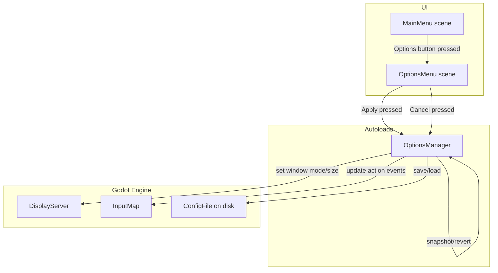

# Design Document: Game Options System

## Overview

The Game Options System adds player-configurable display and input settings to Dark Ascension. It introduces two new components: an `OptionsManager` autoload singleton that owns all settings state and persistence logic, and an `OptionsMenu` UI scene accessible from the main menu. The system covers display mode switching (fullscreen, borderless, windowed), resolution selection, WASD key rebinding with swap-on-conflict, and round-trip persistent storage via Godot's `ConfigFile` at `user://settings.cfg`.

The game launches in fullscreen at 1920×1080 by default. On subsequent launches, saved settings are loaded and applied before the first scene is displayed. The options menu supports Apply (save + close) and Cancel (revert + close) workflows.

## Architecture



The `OptionsManager` is registered as a Godot autoload so it is available before any scene loads. It follows the same pattern as the existing `GameManager` and `SoulEnergyManager` autoloads. On `_ready()`, it loads settings from disk (or applies defaults) and configures the window and input map immediately.

The `OptionsMenu` is a `Control` scene instanced as a child of the `MainMenu`. When opened, it snapshots the current settings from `OptionsManager`. The player edits a local copy. Apply commits the copy to `OptionsManager` and saves to disk. Cancel restores the snapshot.

## Components and Interfaces

### OptionsManager (Autoload — `scripts/autoloads/options_manager.gd`)

Singleton responsible for all settings state, application, and persistence.

```
State:
  display_mode: int          # 0 = Fullscreen, 1 = Borderless, 2 = Windowed
  resolution_index: int      # Index into RESOLUTIONS array
  key_bindings: Dictionary   # { "move_up": KEY_W, "move_down": KEY_S, ... }

Constants:
  RESOLUTIONS: Array[Vector2i] = [
    Vector2i(1920, 1080),
    Vector2i(1600, 900),
    Vector2i(1280, 720),
    Vector2i(1024, 576)
  ]
  DISPLAY_MODES: PackedStringArray = ["Fullscreen", "Borderless Window", "Windowed"]
  ACTIONS: PackedStringArray = ["move_up", "move_down", "move_left", "move_right"]
  DEFAULT_BINDINGS: Dictionary = {
    "move_up": KEY_W, "move_down": KEY_S,
    "move_left": KEY_A, "move_right": KEY_D
  }
  SETTINGS_PATH: String = "user://settings.cfg"

Methods:
  _ready() -> void
    Load settings from disk or apply defaults; apply display + input immediately.

  apply_display_mode(mode: int) -> void
    Set window mode via DisplayServer. If Windowed, also resize to current resolution.

  apply_resolution(index: int) -> void
    Update viewport size and, if windowed, resize the window.

  rebind_key(action: String, new_keycode: int) -> void
    Assign new_keycode to action. If new_keycode is already bound to another
    WASD action, swap the two bindings. Update InputMap for affected actions.
    Preserve non-WASD events (arrow keys) on each action.

  apply_key_bindings() -> void
    Rebuild InputMap events for all four WASD actions from key_bindings dict,
    preserving any non-WASD events already on each action.

  save_settings() -> void
    Write display_mode, resolution_index, and key_bindings to ConfigFile at SETTINGS_PATH.

  load_settings() -> bool
    Read ConfigFile from SETTINGS_PATH. Return true if loaded successfully.
    On failure, apply defaults.

  get_settings_snapshot() -> Dictionary
    Return a deep copy of { display_mode, resolution_index, key_bindings }.

  apply_snapshot(snapshot: Dictionary) -> void
    Restore state from snapshot and re-apply display + input settings.

  reset_to_defaults() -> void
    Set display_mode=0, resolution_index=0, key_bindings=DEFAULT_BINDINGS copy.
```

### OptionsMenu (UI Scene — `scenes/options_menu.tscn` + `scripts/ui/options_menu.gd`)

Control scene containing display and input settings UI.

```
Node tree:
  OptionsMenu (Control)
    ├── PanelContainer
    │   └── VBoxContainer
    │       ├── TitleLabel ("Options")
    │       ├── DisplaySection (VBoxContainer)
    │       │   ├── DisplayModeLabel
    │       │   └── DisplayModeOption (OptionButton) — 3 items
    │       ├── ResolutionSection (VBoxContainer)
    │       │   ├── ResolutionLabel
    │       │   └── ResolutionOption (OptionButton) — 4 items
    │       ├── KeyBindSection (VBoxContainer)
    │       │   ├── KeyBindLabel
    │       │   ├── MoveUpRow (HBoxContainer) — Label + RebindButton
    │       │   ├── MoveDownRow (HBoxContainer)
    │       │   ├── MoveLeftRow (HBoxContainer)
    │       │   └── MoveRightRow (HBoxContainer)
    │       └── ButtonRow (HBoxContainer)
    │           ├── ApplyButton
    │           └── CancelButton

Script interface:
  var _snapshot: Dictionary          # Settings state when menu was opened
  var _pending_action: String        # Action currently awaiting rebind (empty = not listening)

  func open() -> void
    Snapshot current settings, populate UI controls from OptionsManager state, show menu.

  func _on_apply_pressed() -> void
    Commit current UI selections to OptionsManager, save to disk, close menu.

  func _on_cancel_pressed() -> void
    Restore snapshot via OptionsManager.apply_snapshot(), close menu.

  func _on_rebind_button_pressed(action: String) -> void
    Enter listening state for the given action. Update button text to "Press a key...".

  func _unhandled_input(event: InputEvent) -> void
    If listening and event is InputEventKey pressed, call OptionsManager.rebind_key(),
    update UI, exit listening state.
```

### MainMenu Changes (`scripts/ui/main_menu.gd`)

Add handler for the existing `OptionsButton` node to instance and open the `OptionsMenu`.

```
  var options_menu: Control

  func _on_options_button_pressed() -> void
    If options_menu is null, instance the OptionsMenu scene and add as child.
    Call options_menu.open().
```

## Data Models

### Settings ConfigFile Format

The `ConfigFile` at `user://settings.cfg` uses two sections:

```ini
[display]
mode=0
resolution_index=0

[input]
move_up=87
move_down=83
move_left=65
move_right=68
```

- `mode`: int matching `display_mode` (0=Fullscreen, 1=Borderless, 2=Windowed)
- `resolution_index`: int index into `RESOLUTIONS`
- `move_*`: int keycode values from Godot's `Key` enum

### Settings Snapshot Dictionary

Used for cancel/revert flow:

```gdscript
{
  "display_mode": int,
  "resolution_index": int,
  "key_bindings": { "move_up": int, "move_down": int, "move_left": int, "move_right": int }
}
```

### Default Settings

| Setting          | Default Value |
|------------------|---------------|
| display_mode     | 0 (Fullscreen)|
| resolution_index | 0 (1920×1080) |
| move_up          | KEY_W (87)    |
| move_down        | KEY_S (83)    |
| move_left        | KEY_A (65)    |
| move_right       | KEY_D (68)    |


## Correctness Properties

*A property is a characteristic or behavior that should hold true across all valid executions of a system — essentially, a formal statement about what the system should do. Properties serve as the bridge between human-readable specifications and machine-verifiable correctness guarantees.*

### Property 1: Settings serialization round-trip

*For any* valid settings state (display_mode in 0..2, resolution_index in 0..3, and four movement action keycodes each being a valid Godot Key value), saving the settings to a ConfigFile and then loading them back shall produce an equivalent settings state — same display_mode, same resolution_index, and same key_bindings dictionary.

**Validates: Requirements 5.6, 5.1, 5.5, 1.2**

### Property 2: Rebind assigns key and updates InputMap

*For any* movement action and *any* valid keycode that is not already bound to that action, calling `rebind_key(action, keycode)` shall result in `key_bindings[action]` equaling the new keycode, and the Godot InputMap for that action shall contain an InputEventKey with that keycode.

**Validates: Requirements 4.3, 4.5**

### Property 3: Swap on conflict

*For any* two distinct movement actions A and B where A is bound to keycode K_A and B is bound to keycode K_B, calling `rebind_key(A, K_B)` shall result in A being bound to K_B and B being bound to K_A (the bindings are swapped, not duplicated or lost).

**Validates: Requirements 4.4**

### Property 4: Non-WASD events preserved on rebind

*For any* movement action that has non-WASD InputEventKey events (e.g., arrow keys) in the InputMap, after calling `rebind_key` for that action with any new keycode, the non-WASD events shall still be present in the InputMap for that action.

**Validates: Requirements 4.6**

### Property 5: Snapshot revert round-trip

*For any* valid settings state, taking a snapshot via `get_settings_snapshot()`, then modifying the settings to a different valid state, then calling `apply_snapshot()` with the original snapshot, shall restore the settings to the original state — same display_mode, resolution_index, and key_bindings.

**Validates: Requirements 6.4**

## Error Handling

| Scenario | Behavior |
|---|---|
| Settings file missing at startup | `load_settings()` returns false; `OptionsManager` calls `reset_to_defaults()` and applies fullscreen 1920×1080 with WASD bindings. |
| Settings file corrupted / unparseable | `ConfigFile.load()` returns an error code; same fallback as missing file. |
| Invalid display_mode value in file (e.g., 5) | Clamp to valid range 0..2 during load; default to 0 if out of range. |
| Invalid resolution_index in file | Clamp to valid range 0..3 during load; default to 0 if out of range. |
| Invalid keycode in file (0 or negative) | Fall back to the corresponding default binding from `DEFAULT_BINDINGS`. |
| Duplicate keycodes in file (two actions share a key) | Accept as-is on load — the swap logic only applies during interactive rebinding. |
| Save fails (disk full, permissions) | `ConfigFile.save()` returns error; log a warning via `push_warning()`. Settings remain applied in memory for the current session. |
| Player presses a non-keyboard input during rebind listening | Ignore the event; continue listening for an `InputEventKey`. |
| Player presses Escape during rebind listening | Cancel the rebind; restore the button text to the current binding. |

## Testing Strategy

### Testing Framework

Tests use the existing project infrastructure:
- `GdUnitTestSuite` shim (`tests/helpers/gdunit_shim.gd`) for test lifecycle and assertions
- `PropertyTestRunner` (`tests/helpers/property_test_runner.gd`) for property-based tests with 100 iterations per property
- Console runner (`tests/run_tests.gd`) for headless execution

### Unit Tests

Unit tests cover specific examples, defaults, and edge cases:

- **Default settings**: Verify that when no file exists, `OptionsManager` state is fullscreen, 1920×1080, WASD defaults (Requirements 1.1, 3.4)
- **Display mode constants**: Verify `DISPLAY_MODES` array has 3 entries and `RESOLUTIONS` has 4 entries (Requirements 2.1, 3.1)
- **Corrupted file fallback**: Write garbage to `user://settings.cfg`, call `load_settings()`, verify defaults are applied (Requirement 5.4)
- **Missing file fallback**: Ensure `load_settings()` on a non-existent path returns false and defaults are set (Requirement 5.4)
- **Settings path**: Verify `SETTINGS_PATH == "user://settings.cfg"` (Requirement 5.2)
- **Rebind with same key**: Rebinding an action to its current key should be a no-op

### Property-Based Tests

Each property test uses `PropertyTestRunner` with 100 iterations and references its design property.

| Test | Property | Generator |
|---|---|---|
| `test_property_1_settings_round_trip` | Feature: game-options-system, Property 1: Settings serialization round-trip | Random display_mode (0..2), resolution_index (0..3), four random keycodes from a pool of valid keys |
| `test_property_2_rebind_assigns_key` | Feature: game-options-system, Property 2: Rebind assigns key and updates InputMap | Random action from ACTIONS, random keycode from valid key pool |
| `test_property_3_swap_on_conflict` | Feature: game-options-system, Property 3: Swap on conflict | Two distinct random actions, each with a random keycode; rebind first action to second's keycode |
| `test_property_4_non_wasd_preserved` | Feature: game-options-system, Property 4: Non-WASD events preserved on rebind | Random action, random new keycode; verify arrow key events survive |
| `test_property_5_snapshot_revert` | Feature: game-options-system, Property 5: Snapshot revert round-trip | Two random valid settings states; snapshot first, apply second, revert to snapshot |

### Test File

All options system tests go in `tests/test_options_manager.gd`, registered in `tests/run_tests.gd`.

### Property-Based Testing Configuration

- Library: `PropertyTestRunner` (existing in `tests/helpers/property_test_runner.gd`)
- Iterations: 100 per property
- Each property-based test is tagged with a comment: `# Feature: game-options-system, Property N: <title>`
- Each correctness property maps to exactly one property-based test
