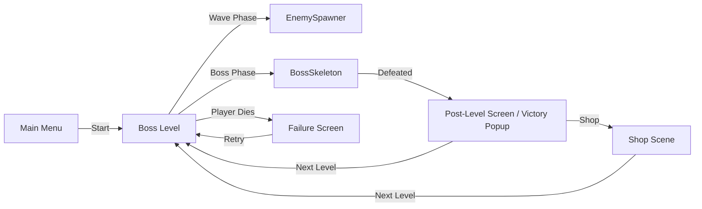
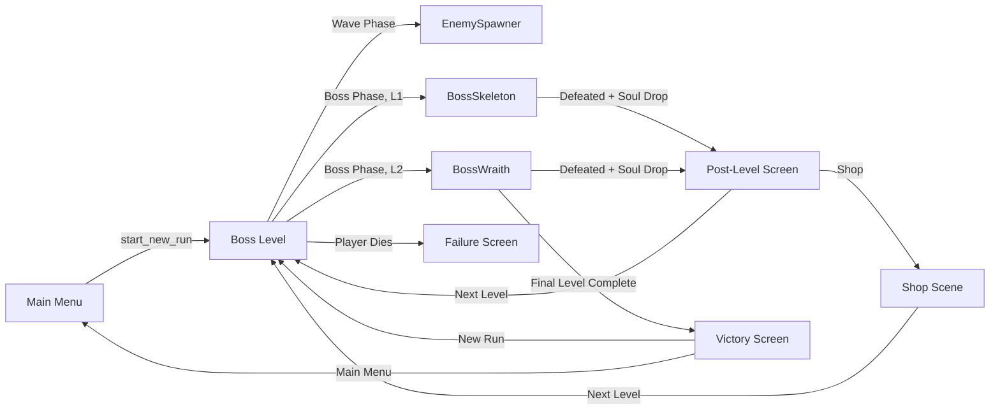
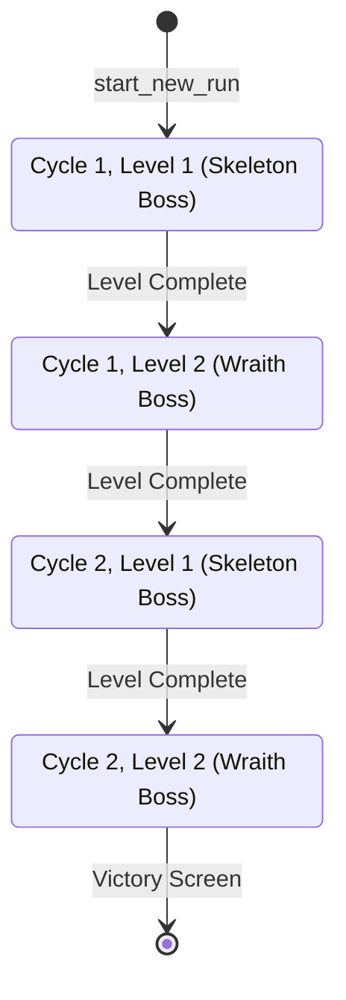

# Design Document: Level Progression and Shard Stats

## Overview

This design adds a finite multi-level game loop and functional shard stat application to Dark Ascension. Currently the game has a single boss level (skeleton boss) that repeats indefinitely with no stat effects from shards. This feature introduces:

1. A **Boss Wraith** enemy for Level 2, mirroring the Boss Skeleton pattern
2. A **finite game loop**: Level 1 → Level 2 → Level 1 → Level 2 → Victory
3. **Boss soul drops** so bosses reward the player with souls on defeat
4. **Functional shard stats**: attack speed, cooldown reduction, damage amp, and soul bonus all apply to gameplay
5. A **Victory Screen** displayed when the player completes all four levels

The design builds on the existing architecture: `LevelManager` orchestrates boss levels, `GameManager` holds run state, `StatBonusApplier` reads the `RelicGrid`, and the `Enemy` base class handles soul drops via `_spawn_soul_drop()`.

## Architecture

### Current Flow



### Proposed Flow



### Level Progression State Machine



### Key Design Decisions

1. **Reuse the single `boss_level.tscn` scene** — `LevelManager` reads `current_level` from `GameManager` to decide which boss to spawn. No need for separate level scenes.

2. **`GameManager` owns progression state** — `current_level` (1 or 2) and `current_cycle` (1 or 2) live on `GameManager` and are persisted in `save_run_state()` / `load_run_state()`. This keeps the level manager stateless regarding progression.

3. **Boss Wraith extends `GhostEnemy`** — Mirrors the `BossSkeleton extends SkeletonEnemy` pattern. Overrides health, damage, scale, and emits `boss_defeated`.

4. **Soul drops already work for regular enemies** — The `Enemy.die()` method calls `_spawn_soul_drop()` which uses `soul_value`. Boss enemies inherit this. `BossSkeleton.die()` calls `super.die()` which already spawns the drop. The only fix needed is ensuring `BossSkeleton` has a non-zero `soul_value` (it already does: 50).

5. **Separate attack speed and cooldown reduction** — The current `StatBonusApplier` lumps them together (`total_cd_reduce = cd_reduce_pct + atk_speed_pct`). The design separates them: attack speed reduces `attack_cooldown`, cooldown reduction reduces `resurrection_cooldowns`.

6. **Stat application at impact time for projectiles** — `Projectile` reads `damage_amp` from `StatBonusApplier` when it hits, not when spawned. This ensures mid-level relic grid changes (if any) take effect immediately.

7. **Victory Screen as a new `VictoryScreen` class** — Follows the `FailureScreen` pattern: a `Control` node built programmatically, shown via `CanvasLayer`.

## Components and Interfaces

### New Components

#### `BossWraith` (scripts/entities/boss_wraith.gd)
```
extends GhostEnemy
class_name BossWraith

signal boss_defeated

Properties:
  max_health = 250.0
  move_speed = 50.0
  contact_damage = 15.0
  soul_value = 75
  scale = Vector2(2.0, 2.0)
  attack_cooldown = 1.5

Methods:
  _ready() -> void        # Calls super, overrides stats
  die() -> void           # Emits boss_defeated, calls super.die()
```

#### `VictoryScreen` (scripts/ui/victory_screen.gd)
```
extends Control
class_name VictoryScreen

signal new_run_pressed
signal menu_pressed

Properties:
  title_label: Label
  soul_label: Label
  new_run_button: Button
  menu_button: Button

Methods:
  _ready() -> void
  _build_ui() -> void
```

### Modified Components

#### `GameManager` — New progression state
```
New properties:
  current_level: int = 1       # 1 or 2
  current_cycle: int = 1       # 1 or 2

New methods:
  advance_level() -> void      # Advances to next level/cycle in sequence
  is_final_level() -> bool     # Returns true when current_cycle == 2 and current_level == 2
  
Modified methods:
  start_new_run()              # Also resets current_level and current_cycle to 1
  save_run_state() -> Dict     # Includes current_level and current_cycle
  load_run_state(data)         # Restores current_level and current_cycle
```

#### `LevelManager` — Level-aware boss spawning
```
New constants:
  BOSS_WRAITH_SCENE_PATH := "res://scenes/boss_wraith.tscn"

Modified methods:
  _start_boss_phase()          # Reads GameManager.current_level to pick boss scene
  _on_boss_defeated()          # Calls GameManager.advance_level()
  _on_level_complete()         # Shows VictoryScreen if is_final_level(), else PostLevelScreen
  _clear_regular_enemies()     # Also excludes BossWraith from clearing
  _on_continue_pressed()       # Saves run state before scene transition
```

#### `StatBonusApplier` — Separated attack speed and cooldown reduction
```
Modified methods:
  _apply_to_player(bonuses)    # Attack speed reduces attack_cooldown; cooldown reduction is separate
  _apply_to_shadows(bonuses)   # Attack speed reduces shadow attack_cooldown; cooldown reduction stored
  
New properties:
  resurrection_cooldown_multiplier: float  # (1.0 - cd_reduction / 100), clamped to min 0.1
```

#### `ShadowResurrectionSystem` — Uses effective cooldowns
```
Modified:
  on_shadow_died()             # Reads effective cooldown from StatBonusApplier instead of hardcoded values
```

#### `Projectile` — Damage amplification
```
Modified methods:
  _on_body_entered(body)       # Reads damage_amp from StatBonusApplier, applies multiplier
```

#### `SoulDrop` — Soul bonus application
```
Modified methods:
  _on_body_entered(body)       # Reads soul_bonus from StatBonusApplier, applies multiplier, rounds to int
```

#### `PostLevelScreen` — No changes needed
The existing `PostLevelScreen` emits `continue_pressed` which `LevelManager` handles. The level manager will call `GameManager.advance_level()` before transitioning.

#### `ShopScene` — Level state preservation
```
Modified methods:
  _on_next_level()             # Ensures run state includes level/cycle before transition
```

### New Scene

#### `boss_wraith.tscn`
Mirrors `boss_skeleton.tscn` structure: a `CharacterBody2D` root with `AnimatedSprite2D`, `HealthBar`, `CollisionShape2D`, and the `BossWraith` script attached. Uses ghost enemy sprites at 2x scale.

## Data Models

### Progression State (in GameManager)

| Field | Type | Default | Description |
|-------|------|---------|-------------|
| `current_level` | `int` | `1` | Active level number (1 or 2) |
| `current_cycle` | `int` | `1` | Current run cycle (1 or 2) |

### Level Progression Sequence

| Step | Cycle | Level | Boss | On Complete |
|------|-------|-------|------|-------------|
| 1 | 1 | 1 | BossSkeleton | Advance to C1L2 |
| 2 | 1 | 2 | BossWraith | Advance to C2L1 |
| 3 | 2 | 1 | BossSkeleton | Advance to C2L2 |
| 4 | 2 | 2 | BossWraith | Show Victory Screen |

### Boss Stats Comparison

| Stat | BossSkeleton | BossWraith |
|------|-------------|------------|
| `max_health` | 200 | 250 |
| `move_speed` | 70 | 50 |
| `contact_damage` | 20 | 15 |
| `soul_value` | 50 | 75 |
| `attack_type` | Melee | Ranged (projectile) |
| `attack_cooldown` | 1.0 (inherited) | 1.5 |
| `scale` | 2x | 2x |

### Stat Application Summary

| Stat Type | Affects | Formula | Min Clamp |
|-----------|---------|---------|-----------|
| `ATTACK_SPEED` | Player & Shadow `attack_cooldown` | `base * max(0.1, 1.0 - atk_speed / 100)` | 10% of base |
| `COOLDOWN_REDUCTION` | Shadow `resurrection_cooldowns` | `base * max(0.1, 1.0 - cd_reduce / 100)` | 10% of base |
| `DAMAGE_AMP` | Player projectile damage | `base_dmg * (1 + damage_amp / 100)` | N/A |
| `SOUL_BONUS` | Soul drop value | `soul_value * (1 + soul_bonus / 100)`, rounded | N/A |
| `MOVEMENT_SPEED` | Player & Shadow movement | `base * (1 + move_pct / 100)` | N/A (unchanged) |
| `MAX_HEALTH` | Player & Shadow HP | `base + hp_bonus` | N/A (unchanged) |
| `HEALING_RATE` | Shadow regen | `base + heal_bonus` | N/A (unchanged) |

### Run State Serialization (updated)

```gdscript
{
    "soul_energy": int,
    "relic_grid": Dictionary,
    "shard_inventory": Array,
    "current_level": int,    # NEW
    "current_cycle": int,    # NEW
}
```

## Correctness Properties

*A property is a characteristic or behavior that should hold true across all valid executions of a system — essentially, a formal statement about what the system should do. Properties serve as the bridge between human-readable specifications and machine-verifiable correctness guarantees.*

### Property 1: Level progression advance produces correct next state

*For any* valid progression state (cycle in {1,2}, level in {1,2}) that is not the final level (cycle=2, level=2), calling `advance_level()` should produce the correct next state: if level is 1, advance to level 2 with same cycle; if level is 2, advance to level 1 with cycle incremented by 1.

**Validates: Requirements 6.1, 6.2, 6.3**

### Property 2: Run state serialization round-trip preserves progression

*For any* valid run state containing current_level (1 or 2), current_cycle (1 or 2), and soul_energy (non-negative integer), calling `save_run_state()` followed by `load_run_state()` on the resulting dictionary should restore current_level, current_cycle, and soul_energy to their original values.

**Validates: Requirements 6.5, 8.2**

### Property 3: New run resets progression state

*For any* arbitrary values of current_level and current_cycle, calling `start_new_run()` should reset current_level to 1 and current_cycle to 1.

**Validates: Requirements 3.3, 14.1**

### Property 4: Attack speed reduces attack cooldown with floor clamp

*For any* base attack cooldown (positive float) and any attack speed percentage (non-negative float), the effective attack cooldown should equal `base * max(0.1, 1.0 - attack_speed / 100.0)`. This applies to both the Player and all registered Shadows.

**Validates: Requirements 9.1, 9.2**

### Property 5: Attack speed and cooldown reduction are independent stats

*For any* relic grid configuration, changing only the attack speed bonus should affect attack cooldowns but not resurrection cooldowns, and changing only the cooldown reduction bonus should affect resurrection cooldowns but not attack cooldowns.

**Validates: Requirements 9.3**

### Property 6: Cooldown reduction reduces resurrection cooldown with floor clamp

*For any* base resurrection cooldown (positive float) and any cooldown reduction percentage (non-negative float), the effective resurrection cooldown should equal `base * max(0.1, 1.0 - cd_reduction / 100.0)`.

**Validates: Requirements 10.1, 10.3**

### Property 7: Damage amplification formula

*For any* base projectile damage (positive float) and any damage_amp percentage (non-negative float), the effective damage dealt on impact should equal `base_damage * (1.0 + damage_amp / 100.0)`.

**Validates: Requirements 12.1**

### Property 8: Soul bonus formula with rounding

*For any* soul_value (positive integer) and any soul_bonus percentage (non-negative float), the souls added to the player's balance should equal `round(soul_value * (1.0 + soul_bonus / 100.0))`.

**Validates: Requirements 13.1, 13.2, 2.3**

## Error Handling

### Boss Spawning Errors
- If the boss scene fails to load (e.g., missing `.tscn`), `LevelManager` should log an error and remain in `BOSS_PHASE` state without crashing. The player can still die or quit.
- If `GameManager.current_level` has an unexpected value (not 1 or 2), default to spawning `BossSkeleton` (Level 1 behavior) and log a warning.

### Progression State Errors
- If `current_level` or `current_cycle` are missing from a loaded run state dictionary, default to `1` for both.
- `advance_level()` should be a no-op if called when already at the final level (cycle=2, level=2) to prevent out-of-bounds state.

### Stat Application Errors
- If `StatBonusApplier` has no registered player or shadows when `apply_bonuses()` is called, it should silently skip application (current behavior, no change needed).
- Cooldown and attack speed percentages are clamped so the effective multiplier never goes below `0.1` (10% of base). This prevents zero or negative cooldowns.
- If `StatBonusApplier` is not accessible (null reference), entities should use their base stats without modification.

### Soul Drop Errors
- If `StatBonusApplier` is not accessible when a soul drop is collected, the raw `soul_value` should be added without any bonus multiplier.
- The soul bonus calculation rounds to the nearest integer to avoid fractional soul values.

### Victory Screen Errors
- If `SoulEnergyManager` is not accessible, the victory screen should display `0` for total souls.
- Both buttons (New Run, Main Menu) must function independently — pressing either should unpause the game tree and transition correctly.

## Testing Strategy

### Property-Based Testing

The project uses **GdUnit4** as the test framework with a custom `PropertyTestRunner` (located at `tests/helpers/property_test_runner.gd`) for property-based testing. Each property test runs a minimum of **100 iterations** with a seeded RNG for reproducibility.

Each property-based test must:
- Reference its design property in a comment: `# Feature: level-progression-and-shard-stats, Property N: <title>`
- Use the `PropertyTestRunner` with a generator callable and a property callable
- Run at least 100 iterations
- Assert `result.passed` is true

Each correctness property (Properties 1–8) must be implemented by a single property-based test. The generators should cover edge cases:
- Property 4 & 6: Include attack_speed / cd_reduction values of 0, 50, 90, 100, and >100 to test clamping
- Property 8: Include soul_bonus values that produce non-integer results to test rounding

### Unit Testing

Unit tests complement property tests by verifying specific examples, integration points, and edge cases:

- **BossWraith configuration**: Verify stats (health=250, soul_value=75, scale=2x), signal emission on die(), inheritance from GhostEnemy
- **Boss soul drops**: Verify BossSkeleton and BossWraith spawn SoulDrop on death with correct soul_value
- **Victory detection**: Verify `is_final_level()` returns true only when cycle=2, level=2
- **Victory Screen UI**: Verify the screen has title label, soul label, new run button, and menu button
- **Stat registration**: Verify player and shadows register with StatBonusApplier on spawn
- **Damage amp at impact time**: Verify projectile reads damage_amp at collision time, not spawn time
- **Shadow projectile damage**: Verify shadow wraith projectiles use the shadow's modified attack_damage

### Test File Organization

| Test File | Covers |
|-----------|--------|
| `tests/test_level_progression.gd` | Properties 1–3, advance_level(), is_final_level(), run state round-trip, new run reset |
| `tests/test_stat_application.gd` | Properties 4–8, attack speed, cooldown reduction, damage amp, soul bonus, stat independence |
