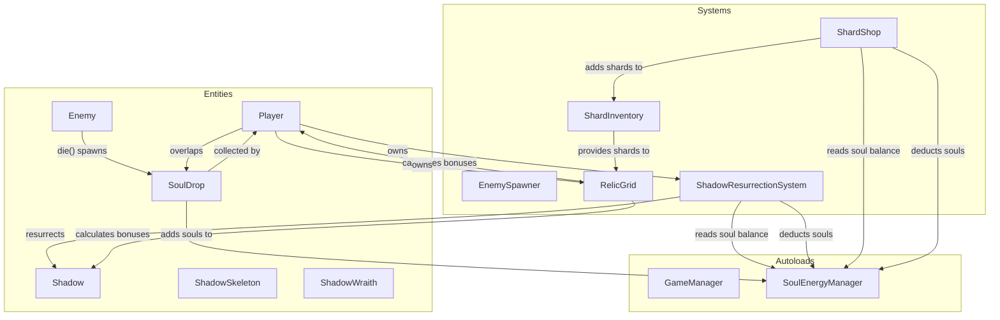

# Design Document: Soul & Relic System

## Overview

The Soul & Relic System adds three interconnected systems to Dark Ascension:

1. **Soul Energy Economy** — Enemies drop physical soul pickups on death. The necromancer collects them by walking over them. Souls serve as dual currency for shadow resurrection and the shard shop.
2. **Shadow Resurrection** — Dead shadows can be revived by spending souls, subject to per-shadow cooldowns. Revived shadows spawn weakened (50% HP) and regenerate over time.
3. **Relic & Shard Grid** — A 3×3 grid (awarded after the first boss) where the player places 1×1 shards for stat bonuses. Shards have directional "receive sides" that trigger adjacency bonuses from cardinal neighbors. Grid is modified between levels only.

These systems integrate with the existing `Shadow`, `Enemy`, `Player`, and `GameManager` classes. The soul economy ties combat rewards to strategic spending, while the relic grid adds a between-levels build-crafting layer.

### Key Design Decisions

- **Physical soul drops** (not auto-collect) — forces positioning decisions during combat, creating tension between fighting and collecting.
- **Per-shadow cooldowns** — prevents instant re-summon spam; the player must survive without a shadow for 8–12 seconds.
- **Directional adjacency** — each shard has 1–4 active "receive" sides. This is more interesting than "any neighbor counts" because shard orientation and grid position matter.
- **Free rearrangement** — no cost to swap shards. The cost is in acquiring shards (shop) and the opportunity cost of soul spending.

## Architecture

The system is organized as three new subsystems that plug into the existing architecture:



### Integration Points

- **Enemy.die()** — Modified to spawn a `SoulDrop` scene at death position. The enemy's `soul_value` export determines drop amount.
- **Player._physics_process()** — Already handles shadow respawns; this is replaced by `ShadowResurrectionSystem` which adds soul cost and input-driven resurrection.
- **Shadow.die()** — Modified to not `queue_free()` immediately. Instead enters dead state, becomes invisible, and notifies `ShadowResurrectionSystem`.
- **GameManager** — Gains reference to `SoulEnergyManager` (new autoload) and `RelicGrid` state for run persistence.

### New Autoload: SoulEnergyManager

A singleton (`scripts/autoloads/soul_energy_manager.gd`) registered as an autoload. Responsible for:
- Tracking current soul total (uncapped integer)
- Providing `add_souls(amount)` and `spend_souls(amount) -> bool`
- Emitting `souls_changed(new_total)` signal for UI binding
- Resetting on new run

This is an autoload because soul energy is referenced by multiple independent systems (resurrection, shop, selling, HUD).

## Components and Interfaces

### SoulEnergyManager (Autoload)

```gdscript
# scripts/autoloads/soul_energy_manager.gd
extends Node

signal souls_changed(new_total: int)

var current_souls: int = 0

func add_souls(amount: int) -> void
func spend_souls(amount: int) -> bool  # returns false if insufficient
func get_souls() -> int
func reset() -> void
```

### SoulDrop (Entity)

```gdscript
# scripts/entities/soul_drop.gd
extends Area2D

@export var soul_value: int = 10
# Visual: small glowing orb with particle trail
# On body_entered (player group) -> SoulEnergyManager.add_souls(soul_value), queue_free()
```

A new scene `scenes/soul_drop.tscn` with:
- `Sprite2D` or `AnimatedSprite2D` for the pickup visual
- `CollisionShape2D` (small circle) on collision layer that detects player
- Collision layer: new layer (e.g., layer 8 for pickups), mask: layer 1 (player)

### ShadowResurrectionSystem

```gdscript
# scripts/systems/shadow_resurrection_system.gd
extends Node

signal shadow_died(shadow_type: String, cooldown: float)
signal cooldown_updated(shadow_type: String, remaining: float)
signal shadow_ready(shadow_type: String, cost: int)
signal resurrection_failed(shadow_type: String, reason: String)

# Per-shadow-type config
var resurrection_costs: Dictionary = {"skeleton": 30, "wraith": 50}
var resurrection_cooldowns: Dictionary = {"skeleton": 8.0, "wraith": 12.0}

# State
var dead_shadows: Dictionary = {}  # shadow_type -> {cooldown_remaining, scene, is_eligible}

func on_shadow_died(shadow_type: String) -> void
func try_resurrect(shadow_type: String) -> bool
func _process(delta) -> void  # ticks cooldowns
```

This replaces the current `handle_shadow_respawns()` in `player.gd`. The player script will hold a reference to this system and call `try_resurrect()` on player input (e.g., pressing 1 or 2).

### Shadow Modifications

The `Shadow` base class gains:
- `is_weakened: bool` — tracks weakened state
- `regen_rate: float = 5.0` — HP/sec during weakened state
- Modified `die()` — instead of `queue_free()`, hides the shadow and emits a signal
- `resurrect_at(position: Vector2)` — resets state, sets HP to 50% max, enters weakened state
- Weakened visual: pulsing teal tint (modulate oscillation)

```gdscript
# Additions to shadow.gd
var is_weakened: bool = false
var regen_rate: float = 5.0

func resurrect_at(pos: Vector2) -> void
func _process_weakened_state(delta: float) -> void
```

### Enemy Modifications

The `Enemy` base class gains:
- `@export var soul_value: int = 10` — configurable per enemy type
- `@export var soul_drop_scene: PackedScene`
- Modified `die()` — spawns `SoulDrop` at death position before death animation/free

### RelicGrid (Resource/System)

```gdscript
# scripts/systems/relic_grid.gd
extends Resource
class_name RelicGrid

const GRID_SIZE := 3

var grid: Array[Array] = []  # 3x3, each cell is Shard or null
var is_unlocked: bool = false

func place_shard(shard: Shard, row: int, col: int) -> bool
func remove_shard(row: int, col: int) -> Shard
func swap_shard(row: int, col: int, new_shard: Shard) -> Shard
func get_shard(row: int, col: int) -> Shard
func calculate_all_bonuses() -> Dictionary  # stat_type -> total_value
func recalculate() -> void
func serialize() -> Dictionary
static func deserialize(data: Dictionary) -> RelicGrid
func reset() -> void
```

The grid is a `Resource` so it can be saved/loaded easily. `calculate_all_bonuses()` iterates all placed shards, evaluates adjacency, and returns aggregated stat modifiers.

### Shard (Resource)

```gdscript
# scripts/systems/shard.gd
extends Resource
class_name Shard

enum StatType {
    COOLDOWN_REDUCTION,
    DAMAGE_AMP,
    ATTACK_SPEED,
    HEALING_RATE,
    MAX_HEALTH,
    MOVEMENT_SPEED,
    SOUL_BONUS,
    CRIT_CHANCE
}

enum Direction { UP, DOWN, LEFT, RIGHT }

@export var shard_name: String
@export var stat_type: StatType
@export var base_value: float
@export var adjacency_bonus_percent: float = 25.0  # % increase per active adjacency
@export var receive_directions: Array[Direction] = []
@export var purchase_price: int = 0
@export var sell_value: int = 0

func get_effective_value(active_adjacency_count: int) -> float
func serialize() -> Dictionary
static func deserialize(data: Dictionary) -> Shard
```

### ShardInventory

```gdscript
# scripts/systems/shard_inventory.gd
extends Node

signal inventory_changed()

var shards: Array[Shard] = []  # all owned shards not in grid

func add_shard(shard: Shard) -> void
func remove_shard(shard: Shard) -> bool
func sell_shard(shard: Shard) -> bool  # removes + adds soul value
func get_all() -> Array[Shard]
func reset() -> void
```

### ShardShop

```gdscript
# scripts/systems/shard_shop.gd
extends Node

signal shop_updated(offers: Array[Shard])

@export var offer_count: int = 5
@export var reroll_cost: int = 20

var current_offers: Array[Shard] = []

func generate_offers() -> void  # picks 5 random from shard pool
func purchase(index: int) -> bool  # deducts souls, adds to inventory
func reroll() -> bool  # deducts reroll cost, regenerates offers
func get_offers() -> Array[Shard]
```

### Shard Pool (Data)

The v1 shard definitions are stored as a static data array or resource file. Each shard type defines:

| Shard Name | Stat Type | Base Value | Adjacency Bonus | Receive Directions | Buy Price | Sell Value |
|---|---|---|---|---|---|---|
| Bone Fragment | Cooldown Reduction | -8% | +25%/adj | DOWN, RIGHT | 40 | 15 |
| Blood Crystal | Damage Amp | +12% | +25%/adj | UP, DOWN, LEFT, RIGHT | 80 | 30 |
| Swift Essence | Attack Speed | +10% | +25%/adj | LEFT, RIGHT | 50 | 20 |
| Vital Marrow | Healing Rate | +3 HP/s | +25%/adj | UP, DOWN | 45 | 18 |
| Soul Stone | Max Health | +15 HP | +25%/adj | UP, LEFT | 55 | 22 |
| Phantom Shard | Movement Speed | +8% | +25%/adj | DOWN, LEFT, RIGHT | 60 | 24 |
| Reaper's Eye | Soul Bonus | +15% | +25%/adj | UP | 35 | 12 |
| Death's Edge | Crit Chance | +5% | +25%/adj | UP, RIGHT, DOWN | 70 | 28 |

8 shard types for v1. Each has a distinct direction pattern creating placement puzzles.

### Adjacency Calculation Algorithm

For each placed shard at position `(row, col)`:
1. Count active adjacencies: for each of the shard's `receive_directions`, check if the neighboring cell in that cardinal direction contains any shard.
2. Compute effective value: `base_value * (1 + adjacency_count * adjacency_bonus_percent / 100)`
3. Aggregate: sum all effective values by stat type across the grid.

```
Example: Blood Crystal at center (1,1) with all 4 directions active
- UP (0,1) has a shard → +1
- DOWN (2,1) has a shard → +1  
- LEFT (1,0) has a shard → +1
- RIGHT (1,2) has a shard → +1
- Active adjacencies = 4
- Effective value = 12% * (1 + 4 * 0.25) = 12% * 2.0 = 24% damage amp
```

## Data Models

### Soul Energy State

```gdscript
# Managed by SoulEnergyManager autoload
var current_souls: int = 0  # uncapped, resets per run
```

### Shadow Resurrection State

```gdscript
# Per dead shadow tracking
var dead_shadows: Dictionary = {
    "skeleton": {
        "cooldown_remaining": 0.0,  # seconds until eligible
        "is_eligible": false,       # true when cooldown expired
        "cost": 30                  # soul cost to resurrect
    },
    "wraith": {
        "cooldown_remaining": 0.0,
        "is_eligible": false,
        "cost": 50
    }
}
```

### Relic Grid State

```gdscript
# 3x3 grid, null = empty slot
var grid: Array = [
    [null, null, null],
    [null, null, null],
    [null, null, null]
]
var is_unlocked: bool = false
```

### Shard Data

```gdscript
# Each shard instance
{
    "shard_name": "Blood Crystal",
    "stat_type": Shard.StatType.DAMAGE_AMP,
    "base_value": 12.0,
    "adjacency_bonus_percent": 25.0,
    "receive_directions": [Direction.UP, Direction.DOWN, Direction.LEFT, Direction.RIGHT],
    "purchase_price": 80,
    "sell_value": 30
}
```

### Serialization Format (for persistence within a run)

```json
{
    "soul_energy": 245,
    "relic_unlocked": true,
    "relic_grid": [
        [null, {"shard_type": "bone_fragment"}, null],
        [{"shard_type": "blood_crystal"}, {"shard_type": "swift_essence"}, null],
        [null, null, null]
    ],
    "shard_inventory": [
        {"shard_type": "vital_marrow"},
        {"shard_type": "reapers_eye"}
    ],
    "dead_shadows": {
        "skeleton": {"cooldown_remaining": 3.2},
        "wraith": {"cooldown_remaining": 0.0, "is_eligible": true}
    }
}
```

### Enemy Soul Values

| Enemy Type | Soul Value |
|---|---|
| Skeleton (melee) | 10 |
| Ghost/Wraith (ranged) | 15 |
| Elite (future) | 40 |
| Boss (future) | 100 |


## Correctness Properties

*A property is a characteristic or behavior that should hold true across all valid executions of a system — essentially, a formal statement about what the system should do. Properties serve as the bridge between human-readable specifications and machine-verifiable correctness guarantees.*

### Property 1: Soul accumulation is additive

*For any* sequence of soul additions with values `[v1, v2, ..., vN]`, the resulting soul total should equal `v1 + v2 + ... + vN`, regardless of the order or number of additions. No upper cap is enforced.

**Validates: Requirements 1.3, 1.6**

### Property 2: Resurrection gating by cooldown and soul cost

*For any* shadow type and any soul balance, a resurrection attempt succeeds (deducting exactly the resurrection cost) if and only if the shadow's cooldown has expired AND the player's soul balance is greater than or equal to the resurrection cost. Otherwise the attempt fails with no change to soul balance or shadow state.

**Validates: Requirements 3.3, 3.4, 4.1, 4.2**

### Property 3: Weakened state health regeneration lifecycle

*For any* shadow that is resurrected, its health should start at exactly 50% of max health. After `t` seconds in weakened state, health should equal `min(max_health, 0.5 * max_health + 5.0 * t)`. The shadow exits weakened state when health reaches max health.

**Validates: Requirements 4.5, 4.6, 4.7**

### Property 4: Relic grid structural invariant

*For any* RelicGrid instance, the grid is always exactly 3 rows by 3 columns (9 slots), and each shard occupies exactly one slot.

**Validates: Requirements 6.3, 7.4**

### Property 5: Shard place-then-remove round trip

*For any* empty grid slot and any shard, placing the shard then removing it should return the grid to its prior state and return the same shard to inventory.

**Validates: Requirements 7.1, 7.2**

### Property 6: Combat lockout of grid and shop operations

*For any* grid operation (place, remove, swap) or shop operation (purchase, reroll, sell) attempted during active combat, the operation should be rejected and no state should change.

**Validates: Requirements 7.5, 12.10**

### Property 7: Cardinal directional adjacency calculation

*For any* grid configuration and any placed shard, the shard's active adjacency count should equal the number of its `receive_directions` where the cardinal neighbor cell in that direction contains any shard. Diagonal neighbors are never counted.

**Validates: Requirements 8.2, 8.3, 8.4, 8.5**

### Property 8: Effective shard value with adjacency bonus

*For any* shard with base value `B`, adjacency bonus percent `P`, and `N` active adjacencies, the effective value should equal `B * (1 + N * P / 100)`.

**Validates: Requirements 9.3**

### Property 9: Total stat bonus aggregation

*For any* grid configuration, the total bonus for each stat type should equal the sum of the effective values of all placed shards of that stat type.

**Validates: Requirements 9.2, 9.5**

### Property 10: Relic grid serialization round trip

*For any* valid RelicGrid state (including placed shards with their positions and properties), serializing then deserializing should produce an identical grid state with identical adjacency bonus calculations.

**Validates: Requirements 8.6, 14.1, 14.5**

### Property 11: Shard inventory serialization round trip

*For any* ShardInventory state, serializing then deserializing should produce an identical collection of shards.

**Validates: Requirements 14.2**

### Property 12: Shard selling adds souls and removes from inventory

*For any* unequipped shard with sell value `V`, selling it should increase the player's soul total by exactly `V` and permanently remove the shard from inventory.

**Validates: Requirements 11.1, 11.2, 11.3**

### Property 13: Shop purchase gating by soul cost

*For any* shop offer at index `i` with price `P`, purchasing succeeds (deducting `P` souls and adding the shard to inventory) if and only if the player's soul balance is >= `P`. Otherwise the purchase fails with no state change.

**Validates: Requirements 12.4, 12.5, 12.6**

### Property 14: Shop reroll replaces offers

*For any* reroll attempt with sufficient soul energy, the shop should deduct the reroll cost and present exactly 5 new shards, all drawn from the v1 shard pool.

**Validates: Requirements 12.7, 12.8, 12.9**

### Property 15: Shard pool invariants

*For all* shard types in the v1 pool, each type has a unique combination of (stat_type, base_value, adjacency_bonus_percent, receive_directions), and each type has between 1 and 4 active receive directions.

**Validates: Requirements 10.2, 10.3**

### Property 16: Relic award idempotence

*For any* player state, awarding the relic when the player already owns one should not change the player's state. `award_relic()` applied twice equals `award_relic()` applied once.

**Validates: Requirements 6.2**

### Property 17: Grid operations have zero soul cost

*For any* shard placement, removal, or swap operation on the relic grid, the player's soul balance before and after the operation should be identical.

**Validates: Requirements 7.6**

## Error Handling

### Soul Energy

- **Negative spend attempt**: `spend_souls()` returns `false` if `amount > current_souls`. No partial deduction.
- **Zero/negative soul values**: Enemy `soul_value` must be >= 1. Validated at scene load. SoulDrop with value <= 0 is discarded.
- **Overflow protection**: Soul total stored as `int` (GDScript uses 64-bit integers). Practically uncapped for gameplay purposes.

### Shadow Resurrection

- **Resurrection of alive shadow**: `try_resurrect()` returns `false` if the shadow is not in the dead state. No-op.
- **Resurrection during cooldown**: Returns `false` with reason `"on_cooldown"`. UI shows remaining time.
- **Insufficient souls**: Returns `false` with reason `"insufficient_souls"`. UI dims the resurrection button.
- **Invalid shadow type**: Unrecognized type string returns `false` with reason `"unknown_type"`.

### Relic Grid

- **Out-of-bounds placement**: `place_shard()` returns `false` for row/col outside [0, 2].
- **Placement on occupied slot**: `place_shard()` returns `false`. Player must remove or swap explicitly.
- **Placement before relic unlocked**: All grid operations return `false` if `is_unlocked == false`.
- **Combat lockout**: All mutation methods check game state and return `false` during active combat.
- **Null shard operations**: `remove_shard()` on empty slot returns `null`. `swap_shard()` with null shard falls back to `place_shard()`.

### Shard Shop

- **Purchase of already-purchased slot**: Returns `false`. Purchased slots are marked as empty/sold.
- **Reroll with insufficient souls**: Returns `false`. Offers remain unchanged.
- **Empty shard pool**: Should not occur in v1 (8 types always available). Defensive check: if pool is empty, generate_offers produces empty array.

### Serialization

- **Corrupt data**: `deserialize()` methods return a default/empty state if the input dictionary is malformed. Log a warning.
- **Missing fields**: Use default values for any missing keys during deserialization.

## Testing Strategy

### Dual Testing Approach

This feature uses both unit tests and property-based tests for comprehensive coverage:

- **Unit tests**: Verify specific examples, edge cases, error conditions, and integration points
- **Property-based tests**: Verify universal properties across randomly generated inputs

### Property-Based Testing Configuration

- **Library**: [GdUnit4](https://github.com/MikeSchulze/gdUnit4) for the test runner, with a custom property-based test helper that generates random inputs and runs each property for a minimum of 100 iterations
- Since GDScript does not have a mature PBT library like QuickCheck or Hypothesis, we implement a lightweight `PropertyTestRunner` utility that:
  - Accepts a callable property and a generator function
  - Runs the property 100+ times with random inputs
  - Reports the first failing input on failure
- Each property test is tagged with a comment: `# Feature: soul-relic-system, Property {N}: {title}`

### Unit Test Coverage

- Soul energy: reset to zero on new run, specific enemy soul values (skeleton=10, ghost=15)
- Resurrection: specific cooldown values (skeleton=8s, wraith=12s), specific costs (30/50)
- Relic: initial empty state after first boss, grid dimensions
- Shard pool: 8 types exist, required stat types present, specific shard data values
- Error cases: out-of-bounds grid access, resurrection of alive shadow, purchase with 0 souls

### Property Test Coverage

Each correctness property (1–17) maps to exactly one property-based test:

| Property | Test Description | Generator |
|---|---|---|
| P1 | Soul accumulation | Random lists of positive integers |
| P2 | Resurrection gating | Random (shadow_type, soul_balance, cooldown_elapsed) |
| P3 | Weakened regen lifecycle | Random (max_health, elapsed_time) |
| P4 | Grid structural invariant | Random grid states via random shard placements |
| P5 | Place/remove round trip | Random (shard, row, col) |
| P6 | Combat lockout | Random operations during combat state |
| P7 | Adjacency calculation | Random grid configurations |
| P8 | Effective value formula | Random (base_value, bonus_percent, adjacency_count) |
| P9 | Total bonus aggregation | Random grid configurations with mixed shard types |
| P10 | Grid serialization round trip | Random grid states |
| P11 | Inventory serialization round trip | Random shard collections |
| P12 | Shard selling | Random (shard, initial_souls) |
| P13 | Shop purchase gating | Random (offer_index, soul_balance) |
| P14 | Shop reroll | Random (soul_balance, reroll_cost) |
| P15 | Shard pool invariants | Enumerate all shard types (exhaustive) |
| P16 | Relic award idempotence | Random player states with/without relic |
| P17 | Grid ops zero cost | Random (operation, shard, position, initial_souls) |

### Test File Organization

```
tests/
├── test_soul_energy_manager.gd      # Unit + property tests for soul economy
├── test_shadow_resurrection.gd       # Unit + property tests for resurrection system
├── test_relic_grid.gd                # Unit + property tests for grid operations + adjacency
├── test_shard.gd                     # Unit + property tests for shard data + effective values
├── test_shard_inventory.gd           # Unit + property tests for inventory + selling
├── test_shard_shop.gd                # Unit + property tests for shop purchase + reroll
├── test_serialization.gd             # Property tests for round-trip serialization
└── helpers/
    └── property_test_runner.gd       # Lightweight PBT utility (generator + runner)
```
